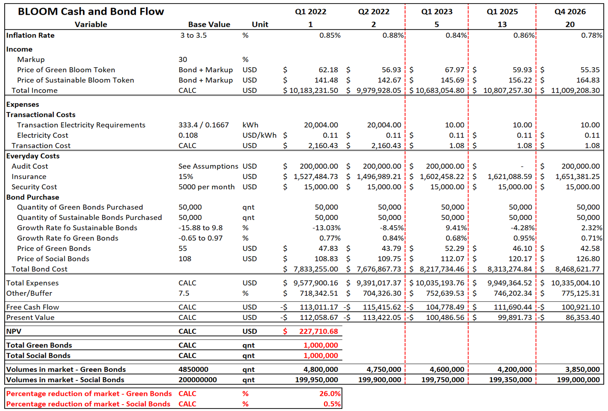

# Cash-flow statement

Crypto is king. A traditional cash flow statement for an early-stage company is vastly more important than the other statement types as it provides an insight into the runway available. To complete the cash flow statement, the following assumptions are made:

* &#x20;Tokens are worth 1.3x bond price. The extra 30% is used to pay for the listed expenses and act as developer ‘reward’
* 50,000 bonds are bought per quarter per type. After all, expenses are covered and the 50% insurance buffer is built, all profits are reinvested into bonds. The estimate of 50,000 bonds per quarter is considered conservative when compared to Klima.dao and Olympus.dao adoption rates.
* Tax, depreciation, and amortization are negligible as it is a decentralised, non-profit taxing platform.
* All costs are in USD2021 stable coin.
* Assume volumes required can be purchased.

NPV of the platform is positive when assuming the 30% Bond markup. However, this is irrelevant and is purely there to demonstrate the longevity of the platform. Importantly, throughout the 5 years, Bloom can remove 26% of the green bond market and 0.5% of the social bond market (the percentages can be adjusted based on community incentive).  Note that these estimates are extremely conservative (especially when considering the growth trajectory of Klima.dao and Olympus.dao). The below figure outlines Bloom’s cash flow.

**As is evident from the above numbers, the platform has long-term sustainability due to the additional 30% markup. This estimate is robust as it accounts for randomized growth and degrowth fluctuations of the relevant variables.**

.png>)
