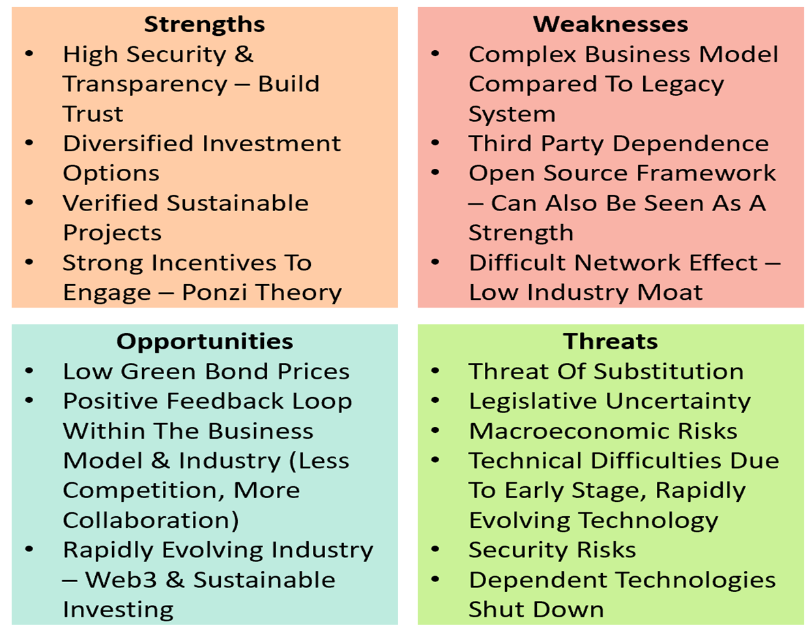

# 💥 Company dynamics

A comprehensive understanding of Bloom's internal environment is required to see where we may experience weaknesses and strengths. Therefore, a SWOT analysis was used to outline wherein the ecosystem Bloom would position itself.

Bloom’s target market is difficult to estimate from the top-down method due to the uncertainty and volatility within the Web3 environment. Therefore, to gain an understanding of the potential, long-term market size, it is best to look at the protocols which came before Bloom – Klima. Dao and Olympus. DAO. Klima asset flow equates to 13,100,974 tonnes of CO2, the equivalent of close to 131,009,740 USD. Olympus. Dao has a current locked value of 2,815,745,135 USD. As the addressable market shifts so rapidly it is better to base growth predictions on these two protocols. Therefore, Bloom’s accessible market is assumed to be between **100 million and 3 billion USD.**

Our strategy is to build a strong user base through network effects. Increasing the user base increases the system's reliability and trustworthiness, both crucial aspects in the web3 ecosystem.
